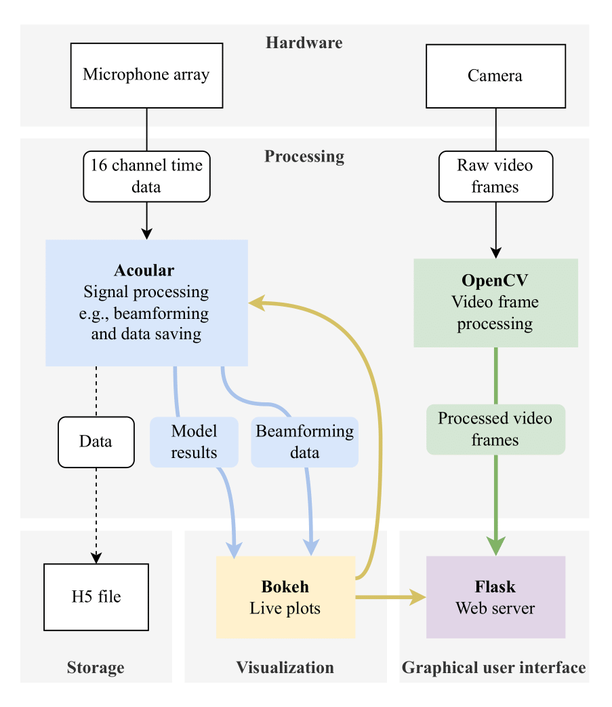

# Acoustic Camera

This project aims to create an acoustic camera that can visualize sound sources in a room.

## Overview

Here is a brief overview of the project structure:

## Requirements

### Hardware

- Microphone Array
- USB Camera (optional)

### Python packages

- Python == 3.11
- Acoular
- TensorFlow (optional)
- OpenCV (optional)
- Flask (optional)

## Environment

1. Create a new environment:   `conda create -n acoustic_camera python=3.11`

2. Activate the environment:   `conda activate acoustic_camera`

3. Install the required libraries:   `pip install -r requirements.txt`

## Usage

- Clone this repository and navigate into the `acoustic-camera` folder.

- To run with default settings, use: `python start.py`.

- To run without video output, use the `--no-flask` flag.

- To use a specific model, add the flag `--model path/to/model/folder`.
